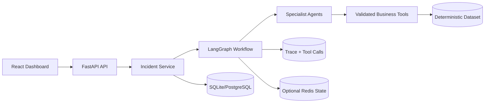

# Autonomous Delivery Resolution Agent

A production-oriented, locally runnable multi-agent system for resolving last-mile delivery incidents. It uses deterministic simulated business systems for reproducible evaluation and supports an optional OpenAI provider for resolution planning.

## Architecture



The system is organized around contracts and ownership boundaries:

- `schemas.py` defines request, response, decision, verification, and trace contracts.
- `db.py` owns durable incident, trace, and tool-call records.
- `tools/` owns simulated business-system access; agents never query storage directly.
- `agents/` owns interpretation and evidence synthesis.
- `graph/` owns LangGraph state transitions and retry limits.
- `api/` owns HTTP concerns only.

## Project structure

```text
autonomous-delivery-agent/
├── backend/app/
│   ├── agents/             # Incident manager and specialist agents
│   ├── api/                # FastAPI routes
│   ├── graph/              # LangGraph state and workflow
│   ├── observability/      # Structured logging and metrics
│   ├── repositories/       # Persistence adapters
│   ├── services/           # Application use cases
│   ├── tools/              # LangChain business tools
│   ├── config.py
│   ├── db.py
│   ├── main.py
│   └── schemas.py
├── backend/tests/
├── data/
├── evaluation/
├── frontend/
├── docker-compose.yml
└── .env.example
```

## Engineering choices

LangGraph is used because the workflow has explicit state, parallel investigation, conditional retry edges, and a verification loop. Specialized agents keep evidence gathering separate from resolution planning. Tools provide a testable boundary between agent decisions and business systems. SQLite is the zero-setup default; PostgreSQL can be selected with `DATABASE_URL`. Redis is optional state acceleration and does not replace durable records.

The local provider is deterministic and evidence-based so the application runs without external APIs. Setting `LLM_PROVIDER=openai` and `OPENAI_API_KEY` enables structured LLM planning; safety validation still constrains supported actions, required identifiers, retries, and tool outcomes.

## Local setup

```powershell
python -m venv .venv
.\.venv\Scripts\Activate.ps1
python -m pip install -r backend\requirements.txt

# Run from the repository root
$env:PYTHONPATH = "backend"
python -m uvicorn app.main:app --app-dir backend --reload
```

API docs are available at `http://localhost:8000/docs`.

## Environment

Copy `.env.example` to `.env`. Secrets are never read from source files or logged. The default configuration uses SQLite, deterministic planning, and no Redis dependency.

## Run the complete stack

```powershell
# Terminal 1: backend
$env:PYTHONPATH = "backend"
python -m uvicorn app.main:app --app-dir backend --reload

# Terminal 2: frontend
cd frontend
npm install
npm run dev
```

The React dashboard is normally available at `http://localhost:5173`. If that port is already in use, Vite automatically selects another port such as `http://localhost:5174`. The backend allows both local Vite ports through CORS.

## Dashboard walkthrough

1. Open the Vite URL printed in the frontend terminal.
2. Use the prefilled incident or enter these deterministic demo values:

  - Order ID: `ORD-1003`
  - Merchant: `MERCHANT-READY`
  - Partner: `PARTNER-BUSY`
  - Location: `Airport`
  - Issue: `Partner unavailable`

3. Click **Create incident**.
4. Click **Run autonomous resolution**.
5. Review the selected action, confidence, verification status, and execution timeline.

For this case, the workflow investigates merchant, traffic, partner, order, and SLA context, selects `reassign_delivery_partner`, executes the simulated action, and verifies the incident as resolved. The API version of the same flow is available through Swagger at `http://localhost:8000/docs`.

## Evaluation

Run the reproducible 50-case evaluation with:

```powershell
$env:PYTHONPATH = "backend"
C:/Python314/python.exe evaluation/evaluate_agents.py
```

The script prints JSON and a readable table, and writes the generated result to `evaluation/results/latest.json`. It measures resolution success, action selection, tool selection, SLA-risk detection, verification, tool calls, local workflow latency, and retries. Results are intentionally generated by execution rather than claimed in advance.

## Docker

```powershell
docker compose up --build
```

The API is exposed on port 8000, the dashboard on port 5173, and Redis on port 6379. SQLite remains the default durable store; use a PostgreSQL `DATABASE_URL` for a deployment environment.

### Python 3.14 reload note

The optional `watchfiles` native reload backend can hang or be interrupted on some Python 3.14 Windows installations. The project intentionally depends on plain `uvicorn`, which uses its portable reload implementation. If an existing environment still has `watchfiles` installed and the reload command fails while importing it, run `C:/Python314/python.exe -m pip uninstall watchfiles` once, or start without reload:

```powershell
C:/Python314/python.exe -m uvicorn app.main:app --app-dir backend
```

## Testing

```powershell
$env:PYTHONPATH = "backend"
C:/Python314/python.exe -m pytest
```

The suite covers deterministic tools, schemas, action guards, LangGraph resolution, and bounded retry behavior. The evaluation runner also exercises the API workflow across 50 deterministic cases.

## Known limitations

- The business systems are deterministic local simulations; no external merchant or carrier APIs are required.
- Redis is included in Docker Compose as an optional infrastructure service, but SQLite remains the active durable store and graph state is not yet checkpointed to Redis.
- The deterministic provider is the default. The optional OpenAI planner requires `OPENAI_API_KEY` and is not exercised by the local test suite.
- The dashboard currently focuses on creating and resolving one incident at a time; historical incident browsing can be added as a next UI increment.
